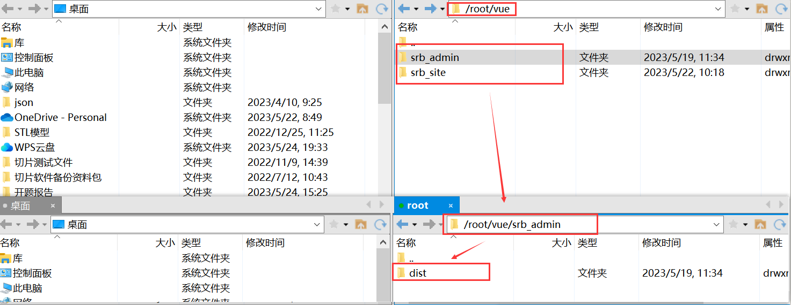
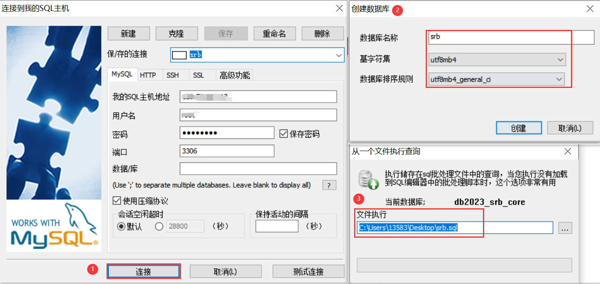
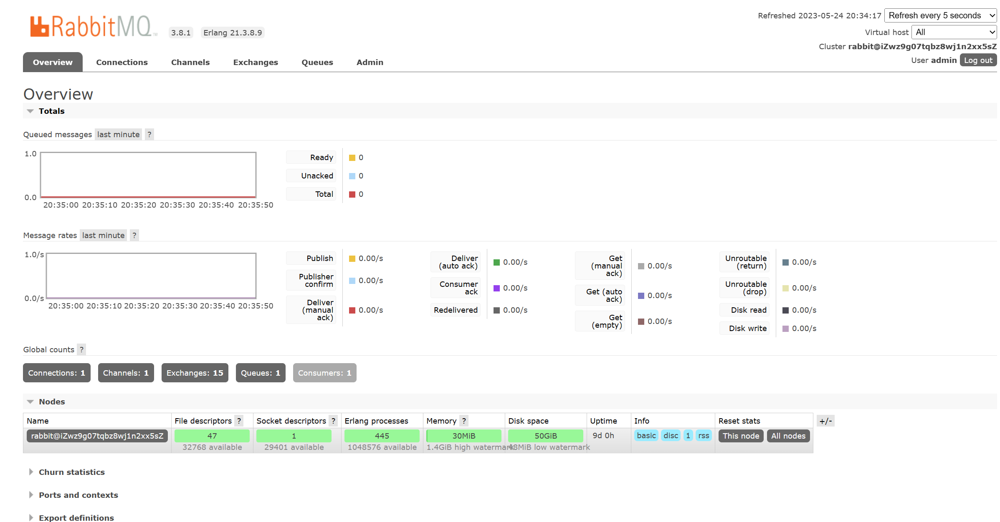

# 尚融宝

## 一 项目简介

尚融宝是一个网络借贷信息中介服务平台，为个人投资者，个人融资用户和未小型企业提供线上信贷及出借服务。本项目**仅仅用于个人学习**。目前该项目已经部署到服务器上，域名为zlwyyds.top。

## 二 项目架构

该项目是基于SpringBoot+SpringCloud+ Vue的前后端分离的微服务项目。客户端通过访问服务器，通过Nginx反向代理访问前端服务器，通过网关Gateway分发请求到微服务service-core、service-sms、service-oss上，并且通过了Nacos将微服务service-gateway、service-core、service-sms、service-oss注册，并且有sentinel熔断机制和openfeign的服务接口调用
数据库有使用MySQL和Redis，并使用了阿里云第三方Api的SMS阿里云短信和OSS的对象存储功能，还使用了消息中间件RabbitMQ。

## 三 开发环境和技术栈

①前置知识：

Java基础、HTML、CSS、JavaScript、Spring、SpringMVC、MyBatis、MyBatisPlus、SpringBoot、SpringCloud、MySQL、Redis、Nginx、IDEA、Maven、CentOS、RabbitMQ等。

②后端技术

1、SpringBoot2.3.4.RELEASE
2、SpringCloud Hoxton.SR8 : 微服务基础设施-服务注册-服务发现、服务熔断、微服务网关、配置中心等SpringCloud 3、Alibaba 2.2.2.RELEASE
4、MyBatis Plus：持久层框架和代码生成器
5、Lombok：简化实体类开发
6、Swagger2 ：Api接口文档生成工具
7、Logback：日志系统
8、alibaba-easyexcel ：Excel读写
9、Spring Data Redis ：Spring项目中访问Redis缓存
10、HTTPClient: 基于Http协议的客户端，用来实现远程调用
11、Spring Task：定时任务

③数据库和中间件

1、MySQL 5.7：关系型数据库   管理工具：SQLyog
2、Redis 5.0：缓存技术   管理工具：RedisDesktopManager
3、RabbitMQ 3.8：消息中间件

④第三方接口

1、阿里云短信：短信网关
2、阿里云OSS：分布式文件存储
3、资金托管平台API对接：汇付宝

⑤前端

1、Node.js： JavaScript 运行环境
2、ES6 ：JavaScript的模块化版本
3、axios ：一个发送Ajax请求的工具
4、Vue.js ：web 界面的渐进式框架
5、Element-UI：前端组件库
6、模块化开发：解决JavaScript变量全局空间污染的问题
7、NPM：模块资源管理器
8、vue-element-admin：基于Vue.js的后台管理系统UI集成方案
9、NuxtJS：基于Vue.js构建的服务器端渲染应用的轻量级框架

⑥开发环境

1、JDK1.8 (配置好环境变量JAVA_HOME、path)
2、Maven3.8.1(配置好环境变量MAVEN_HOME、中央仓库地址、本地仓库地址、JDK版本)
3、IDEA2020(Configure -> settings配置好Java Compiler、File Encoding、Maven、Auto Import、Code Completion、
插件：Lombok、MyBatisX)

## 四 业务流程

## 五 阿里云ICP备案+域名申请+OSS对象存储+SMS短信+Nginx配置

详情请跳转连接：https://blog.csdn.net/SXJMXL/article/details/130258687

## 六 CentOS7环境搭建

① CentOS7配置JDK1.8环境：https://blog.csdn.net/dgfdhgghd/article/details/123207017
② CentOS7配置Redis环境：https://blog.csdn.net/qq_38584262/article/details/125773286
③ CentOS7配置Nginx环境:  https://blog.csdn.net/qq_33381971/article/details/123328191
④ CentOS7配置MySQL环境: https://blog.csdn.net/u013618714/article/details/126179117
⑤ CentOS7配置Nacos环境：https://blog.csdn.net/borners/article/details/102898341

## 七 前端部署

①Vue项目打包得到一个dist文件(打包前将路由http://localhost -> http://zlwyyds.top/srb_admin)：**npm run build :prod**

②基于Vue的Nuxt.js工程打包会得到一个dist文件(打包前将http://localhost ---> http://zlwyyds.top)：**npm run generate**

③ 将打包好的文件放入Linux下(可以用Xshell和Xftp连接阿里云服务器)

## 八 后端部署

① 项目打包注意事项一(**将MyBatis的mapper.xml文件打包进去**)：

② 项目打包注意事项二(**每一个有主启动类的都要配置**)：

③ 项目打包注意事项三(**记得修改ip、端口、数据库账户密码**)：

④ 项目打包注意事项四(**打包的时候记得修改日志路径和日志打印等级**)：

⑤ 项目打包注意事项五：(**配置阿里云第三方接口和微服务Nacos的时候记得修改**)

⑥ 项目打包注意事项六(**gateway网关路由要配置好**)：

⑦ 项目打包注意思想七(**打包格式为jar包、然后排除gateway内置的web依赖，然后clean/package**)：

⑧ 项目打包注意事项八(记得修改ip)：

⑨ 项目上传到Linux服务器上然后运行：

## 九 前后端联调、Nginx配置修改和网关

## 十 数据库的导入、Nacos服务注册发现、RabbitMQ登入

① 连接CentOS的数据库MySQL并导入数据：

② 连接CentOS的数据库Redis：

③ 访问http://zlwyyds.top:8848/nacos可以看到服务注册Nacos登入页：

④ RabbitMQ登入访问：

